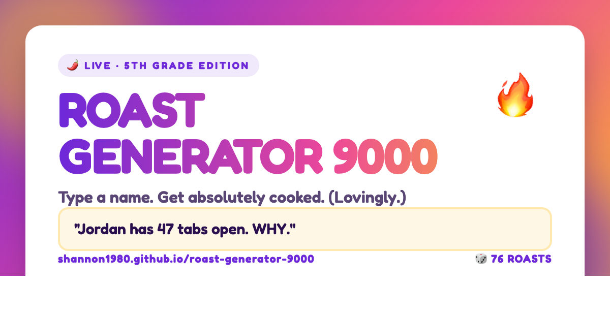

# 🔥 Roast Generator 9000

> Type a name. Get absolutely cooked. (Lovingly.)

A classroom-friendly roast generator with 398 gentle burns, animated gradients, and confetti. Single static HTML file — zero build step.

**Live:** https://shannon1980.github.io/roast-generator-9000/



## Features

- 398 classroom-friendly roasts that target quirky habits, not people
- Deck-shuffle randomizer (every roast plays before any repeats)
- Confetti burst on each roast (pauses when idle to save battery)
- Web Share API + clipboard fallback for sharing
- Permalink support: `?name=Jordan` pre-fills, `?name=Jordan&go=1` auto-roasts
- Light name filter (strips non-letter chars + low-effort profanity)
- Installable as a PWA
- Respects `prefers-reduced-motion`

## Run locally

It's one HTML file. Open `index.html` in any modern browser, or:

```bash
python3 -m http.server 8000
# then open http://localhost:8000
```

## Files

| File | What it is |
|---|---|
| `index.html` | The whole app |
| `manifest.json` | PWA manifest |
| `favicon.svg` | Inline gradient + flame icon |
| `og-image.png` | 1200×630 social preview card |
| `og-image.html` | Source for the OG image (re-render with headless Chrome if you change it) |

### Re-rendering the OG image

```bash
"/Applications/Google Chrome.app/Contents/MacOS/Google Chrome" \
  --headless --disable-gpu --hide-scrollbars \
  --window-size=1200,630 --virtual-time-budget=4000 \
  --screenshot=og-image.png "file://$PWD/og-image.html"
```

## Adding more roasts

Edit the `ROASTS` array in `index.html`. Use `{name}` as the placeholder — it'll be substituted and HTML-escaped automatically.

Tone guidelines:
- Target habits, not appearance, identity, family, or socioeconomic stuff
- Observational and specific (not generic insults)
- Should land with a laugh, not a sting

## License

MIT — see [LICENSE](LICENSE).
